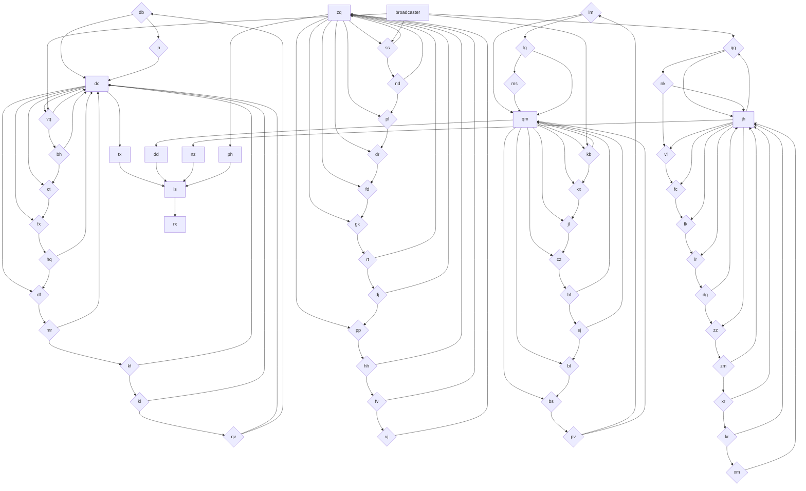

```mermaid
graph TD
zq --> fd & gk & pp & ph & ss & dr & pl
qg --> jh & nk
lm --> lg & qm
fk --> lr
pp --> hh
bf --> sj & qm
qm --> kb & jl & bs & kx & bl & cz & dd
db --> dc & jn
kl --> dc & qv
xm --> jh
ss --> zq & nd
vq --> bh & dc
bl --> bs
fd --> gk
dc --> tx & vq & ct & df & fx
dj --> zq & pp
fv --> vj & zq
pv --> lm & qm
dg --> zz & jh
fc --> fk
qv --> dc & db
ls --> rx
tx --> ls
vl --> fc
dr --> fd
dd --> ls
kx --> jl
sj --> qm & bl
vj --> zq
nk --> jh & vl
xr --> kr & jh
nz --> ls
cz --> bf
ms --> qm
ct --> fx
lg --> qm & ms
lr --> dg
pl --> dr
rt --> zq & dj
jn --> dc
zz --> zm
kf --> kl & dc
jl --> cz
hh --> fv & zq
df --> mr
jh --> zz & lr & vl & fc & nz & fk & qg
fx --> hq
hq --> df & dc
kb --> qm & kx
ph --> ls
broadcaster --> kb & vq & ss & qg
nd --> pl & zq
gk --> rt
mr --> dc & kf
bs --> pv
bh --> dc & ct
kr --> jh & xm
zm --> xr & jh


    bl{bl}
    sj{sj}
    dj{dj}
    lm{lm}
    gk{gk}
    fd{fd}
    zz{zz}
    dg{dg}
    jn{jn}
    kf{kf}
    jl{jl}
    bf{bf}
    qv{qv}
    db{db}
    nd{nd}
    lr{lr}
    ms{ms}
    qg{qg}
    vl{vl}
    hh{hh}
    ct{ct}
    fk{fk}
    xr{xr}
    kl{kl}
    ss{ss}
    df{df}
    pp{pp}
    hq{hq}
    bs{bs}
    zm{zm}
    dr{dr}
    mr{mr}
    fv{fv}
    kb{kb}
    vj{vj}
    fx{fx}
    rt{rt}
    pv{pv}
    xm{xm}
    bh{bh}
    fc{fc}
    pl{pl}
    cz{cz}
    lg{lg}
    kx{kx}
    vq{vq}
    kr{kr}
    nk{nk}

classDef flipFlopOn fill:#f96

```